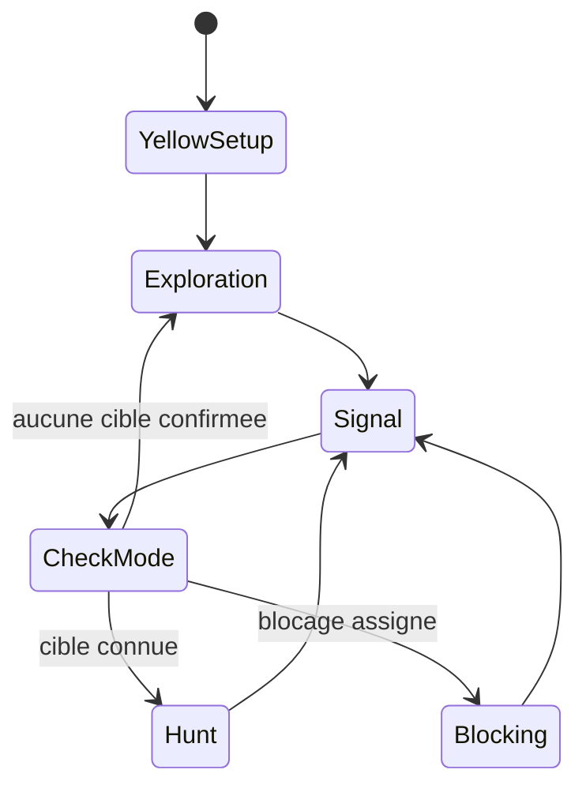

# Exploration multi-agent avec JADE

Système multi-agent coopératif développé en Java avec JADE et Dedale. Des agents autonomes explorent un environnement inconnu représenté sous forme de graphe, échangent leurs connaissances locales, détectent des cibles mobiles à partir de leurs observations et se coordonnent pour les encercler.

Ce projet a été réalisé dans le cadre d'un enseignement de master sur les systèmes multi-agents. Il met en avant la prise de décision distribuée, la communication entre agents, l'exploration de graphe et la coordination collective dans un environnement partiellement observable.

## Points forts

- Agents autonomes pilotés par une machine à états finis : exploration, chasse, signalisation et blocage.
- Construction distribuée d'une carte avec noeuds ouverts/fermés, calcul de plus courts chemins et visualisation GraphStream.
- Partage de connaissances via messages ACL JADE.
- Synchronisation incrémentale de la carte avec des deltas, plutôt qu'un envoi complet du graphe à chaque échange.
- Suivi de plusieurs cibles avec positions confirmées ou inférées.
- Protocole de blocage coopératif basé sur CFP, propositions, attributions et accusés de réception.
- Configuration des scénarios via des fichiers JSON Dedale.

## Stack technique

- Java 21
- Maven
- JADE, framework d'agents
- Dedale, framework de simulation multi-agent
- GraphStream et JavaFX pour la visualisation du graphe
- Jackson pour la sérialisation JSON
- JUnit Jupiter pour les tests et assertions

## Vue d'ensemble

La plateforme démarre depuis `eu.su.mas.dedaleEtu.princ.Principal`. Cette classe crée la plateforme JADE, le gatekeeper Dedale, les conteneurs et les agents configurés.

L'agent principal du projet est `FSMExploAgent`. Chaque agent chasseur maintient sa propre représentation locale du monde et synchronise régulièrement les informations utiles avec les agents à portée de communication.



## Architecture

```text
src/main/java/eu/su/mas/dedaleEtu/
+-- princ/
|   +-- Principal.java              # Démarrage de la plateforme et création des agents
|   +-- ConfigurationFile.java      # Sélection de l'environnement, de la topologie et du scénario
+-- mas/agents/dummies/explo/
|   +-- FSMExploAgent.java          # Agent chasseur principal avec machine à états finis
|   +-- ExploreCoopAgent.java       # Agent de référence pour l'exploration coopérative
|   +-- ExploreSoloAgent.java       # Agent de référence pour l'exploration solo
+-- mas/behaviours/
|   +-- ExplorationBehaviour.java   # Découverte du graphe et navigation vers les frontières
|   +-- HuntBehaviour.java          # Poursuite des cibles et logique de capture
|   +-- SignalBehaviour.java        # Communication des positions, cartes et cibles
|   +-- BlockingCFPBehaviour.java   # Négociation coopérative des positions de blocage
|   +-- BlockerBehaviour.java       # Déplacement et comportement des agents bloqueurs
+-- mas/knowledge/
    +-- MapRepresentation.java      # Graphe local, chemins, odeurs et deltas
    +-- MapDelta.java               # Mises à jour incrémentales de la carte
    +-- MapWithScent.java           # Graphe sérialisable avec informations d'odeur
    +-- GolemInfo.java              # Métadonnées partagées sur les cibles
```

## Fonctionnement

### Exploration

Les agents construisent progressivement une représentation locale du graphe à partir de leurs observations. Les noeuds sont marqués comme ouverts ou fermés, puis l'agent planifie ses déplacements vers le noeud ouvert le plus proche en tenant compte, lorsque c'est possible, des positions déjà occupées par d'autres agents.

### Partage de connaissances

Les agents échangent :

- leurs positions courantes ;
- les mises à jour de topologie découvertes ;
- les informations d'odeur associées aux cibles ;
- les positions confirmées ou inférées des cibles ;
- l'état des captures.

La synchronisation de carte repose sur `MapDelta`, qui permet de partager uniquement les nouvelles arêtes, les changements d'état des noeuds et les mises à jour d'odeur.

### Chasse et blocage

Lorsqu'une cible est détectée, les agents passent du mode exploration au mode chasse. Ils sélectionnent les cibles confirmées atteignables et utilisent les plus courts chemins pour s'en rapprocher.

Quand un agent arrive à proximité d'une cible, il peut lancer une négociation de blocage coopératif :

1. L'agent initiateur envoie un CFP pour le voisinage de la cible.
2. Les agents proches proposent des positions de blocage atteignables.
3. L'initiateur assigne les agents aux noeuds autour de la cible.
4. Les bloqueurs confirment leur affectation et se déplacent vers leur position.
5. L'équipe confirme la capture lorsque la cible est encerclée de manière stable.

## Lancer le projet

### Prérequis

- JDK 21
- Maven 3.9 ou plus récent

### Compilation

```bash
mvn clean compile
```

### Exécution

```bash
mvn exec:java
```

Le point d'entrée par défaut est configuré dans `pom.xml` :

```text
eu.su.mas.dedaleEtu.princ.Principal
```

Au démarrage, le projet ouvre les outils de la plateforme JADE ainsi que les visualisations Dedale/GraphStream.

## Configuration des scénarios

Le scénario actif se configure dans :

```text
src/main/java/eu/su/mas/dedaleEtu/princ/ConfigurationFile.java
```

Champs importants :

- `INSTANCE_TOPOLOGY` : topologie du graphe chargée par Dedale.
- `INSTANCE_CONFIGURATION_ELEMENTS` : éléments présents dans l'environnement.
- `INSTANCE_CONFIGURATION_ENTITIES` : agents et cibles à instancier.
- `DEFAULT_COMMUNICATION_REACH` : portée de communication par défaut.
- `PLATFORM_HOSTNAME`, `PLATFORM_PORT`, `PLATFORM_ID` : paramètres de la plateforme JADE.

Plusieurs fichiers d'exemple sont disponibles dans `resources/`, notamment :

- `agent-3hunters-1human.json`
- `agent-7hunters-3golems.json`
- `agent-2wumpus-3explo.json`

## Compétences démontrées

- Architecture multi-agent avec comportements JADE et messages ACL.
- Coordination distribuée sans contrôleur central pour la prise de décision.
- Algorithmes de graphe pour l'exploration, le pathfinding et l'analyse des points d'articulation.
- Modélisation du comportement agent par machine à états finis.
- Sérialisation et fusion de connaissances partagées entre agents.
- Débogage et visualisation de simulations distribuées.

## Améliorations possibles

- Ajouter des scénarios d'intégration automatisés pour comparer les performances.
- Externaliser le choix du scénario via des arguments en ligne de commande.
- Ajouter une CI avec compilation Maven et exécution des tests.
- Réduire le bruit console et passer à un système de logs structurés.
- Ajouter des captures d'écran ou une courte vidéo de démonstration pour un portfolio.
